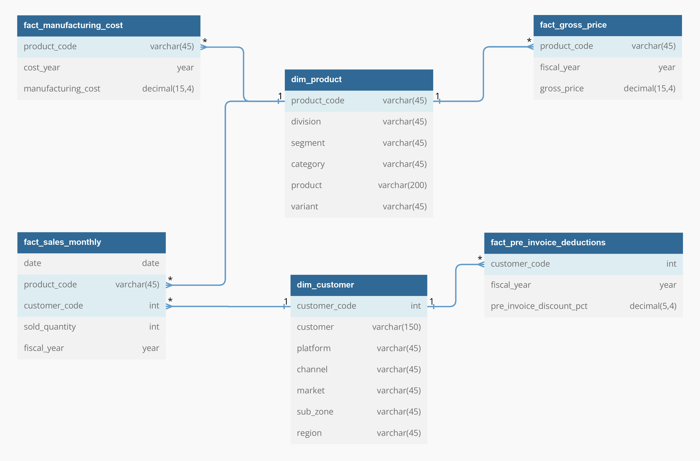
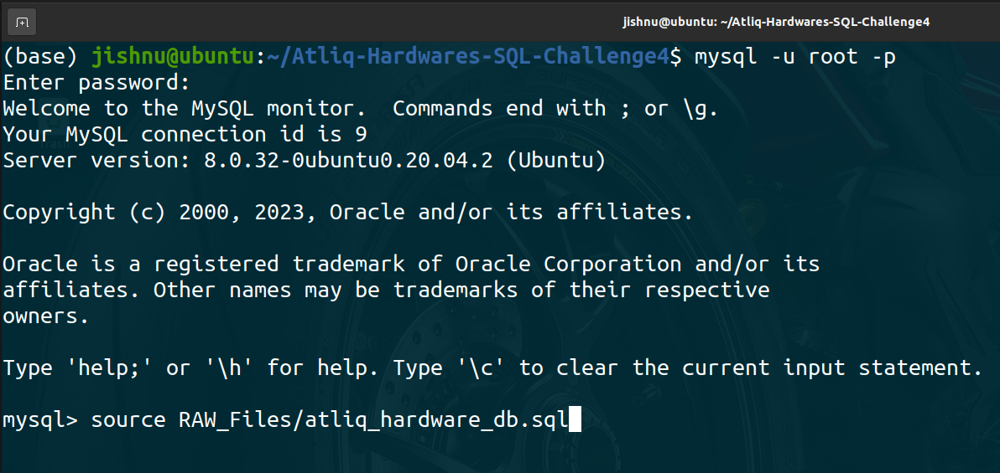
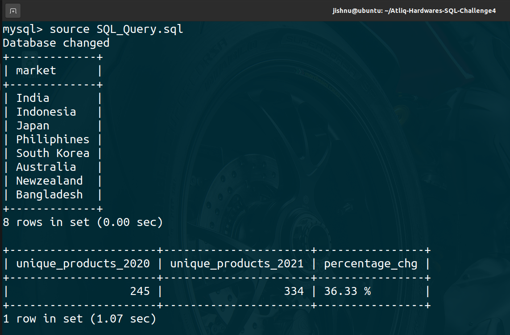
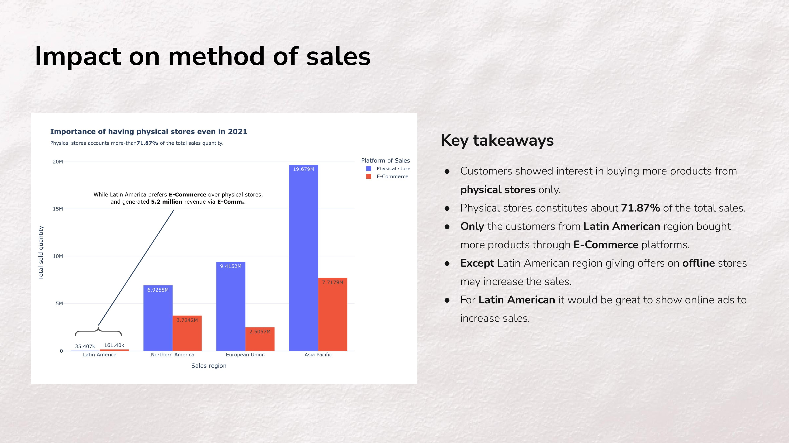
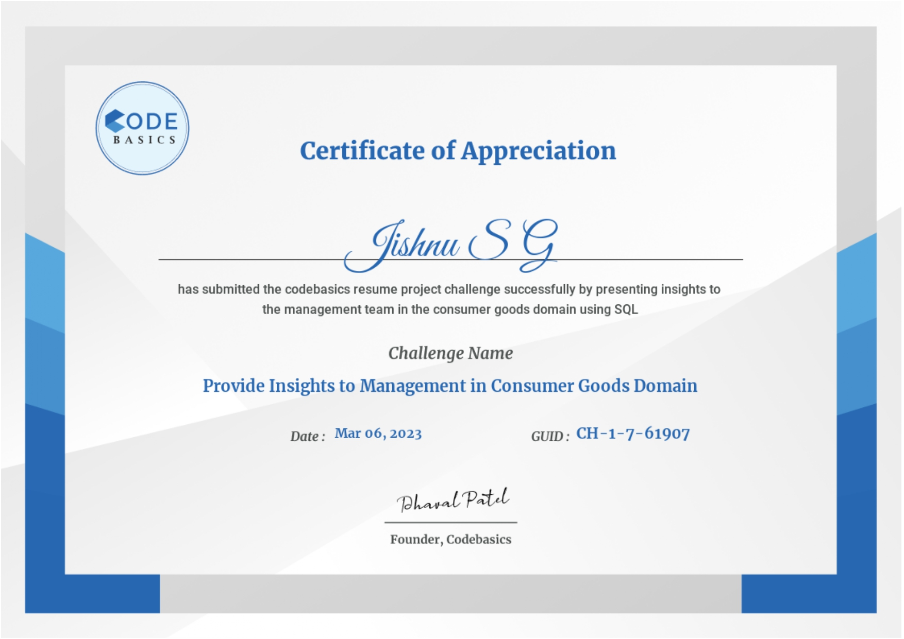

# **Atliq Hardware : A financial and sales analysis**

#### Challenge
Provide Insights to Management in Consumer Goods Domain

#### Domain
Consumer Goods | Function : Excecutive Management

## Problem statement

- Atliq Hardware (imaginary company) is one of the leading computer hardware  producers in India and well expanded in other countries too.
- However, the management noticed that they do not get enough insights to make  quick and smart data-informed decisions.
- Hence, company decided to conduct a SQL challenge which will help them to understand the data.

## Task :

1. Check [ad-hoc-requests.pdf](RAW_Files/ad-hoc-requests.pdf) - there are 10 ad hoc requests for which the business needs insights.
2. Need to run a SQL query to answer these requests. 
3. The target audience of this dashboard is top-level management - hence want to create a presentation to show the insights.

## **Querying Solutions**

I've used **MySQL** to query the data base. The database file is available in [atliq_hardware_db.sql](RAW_Files/atliq_hardware_db.sql) file.

### 1. Data Model



### 2. Database creation

To convert this [atliq_hardware_db.sql](RAW_Files/atliq_hardware_db.sql) file into MySQL database, run the bellow codes.

1. Connect to MySQL Server using terminal using `mysql -u root -p` and enter the *password*.
2. Once the connection is sucessfull type, `source RAW_Files/atliq_hardware_db.sql` to generate Atliq Hardware's database.



### 3. SQL Query

#### Method 1 : Using SQL File

We can use the [SQL_Query.sql](SQL_Query.sql) to run all the queries using MySQL terminal or MySQL Workbench. To run using *terminal* use the code,

```
source SQL_Query.sql
```



#### Method 2 : Using Python

We can utilize the [MySQL python library](https://pypi.org/project/mysql-connector-python/) and Jupyter Notebook for this. The [SQL_Query.ipynb](SQL_Query.ipynb) shows how to connect to a MySQL database using python and how to run the quries.


## **Reports and Presentations**

### Reports

- This PDF file [SQL_Query_Solutions.pdf](SQL_Query_Solutions.pdf) contains all the qustion provided and the terminal outputs.
- Similarly [images/mysql_terminal_solutions/](images/mysql_terminal_solutions/) contains all the 10 query terminal outputs.

### Presentations

**A sample slide from presentation**

<p><a href = 'https://github.com/jishnukoliyadan/Atliq-Hardwares-SQL-Challenge4/blob/master/Presentation.pdf' target = '_blank'> 

</a></p>

- The presentations to the top-level management is stored in [Presentation.pdf](Presentation.pdf) as PDF version and [Presentation.pptx](Presentation.pptx) for powerpoint version.
- The plots for the presentations was made using Plotly viisualization. The notebook used to create plots is [Presentation_plots.ipynb](Presentation_plots.ipynb).
  
    - NOTE : This notebook is not a rendered one. Due to upload size restriction GitHub rejected the rendered one.

**NOTE**

1. More details of the problem statement and data is available at [codebasics.io](https://codebasics.io/challenge/codebasics-resume-project-challenge)

2. **`credentials.py`** only contains MySQL root password, it is created to protect the password. Bellow code shows what contains inside **`credentials.py`** file.

```py
db_password = 'Type-your-MySQL-root-password-here'
```

3. In **`DB_to_CSV.py`** file, the MySQL password entered as,

```py
from credentials import db_password

mydb = mysql.connector.connect(host = 'localhost', user = 'root',
                        password = db_password, database = 'gdb023')
                        
cursorObject = mydb.cursor()
```

## Certificate of Appreciation from [codebasics.io](https://codebasics.io/)

<p><a href = 'https://codebasics.io/download-certificate-pdf/CH-1-7-61907' target = '_blank'> 

</a></p>

## License

The license can be found in the [LICENSE](LICENSE) file.